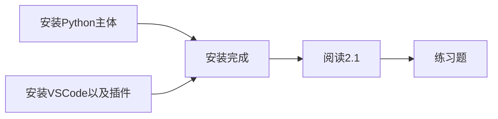
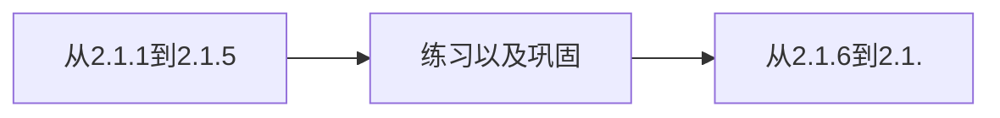

# 关于小盒子学习Python的学习流程计划：
*Verson: 1.0*

---
[TOC]

---
### STEP 1
* **Overview**:

*在没有实现GitHub云端在线预览之前，需要使用`Chrome`以及插件`Chropath`。

* **Detailed plans**：

* **流程思路**：鉴于小盒子在大发地产项目十分的繁忙，以及考虑到时间以及身体上的安排，考虑先学习最基础的输入输出，数据类型和变量。对于学习代码来说，多练习和多巩固是最重要的。在STEP 1中，将会学习最基础的Python知识。然后根据Python对于小盒子的重要性来修改具体的学习时间以及学习流程。学习的最终目标是，了解Python以及读懂代码。
### STEP 2