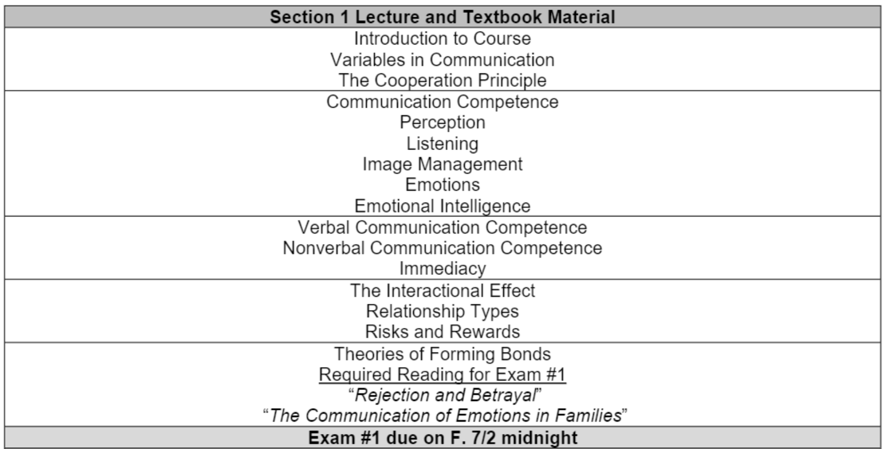
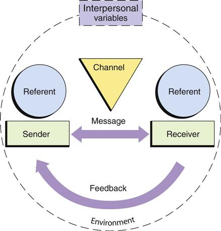
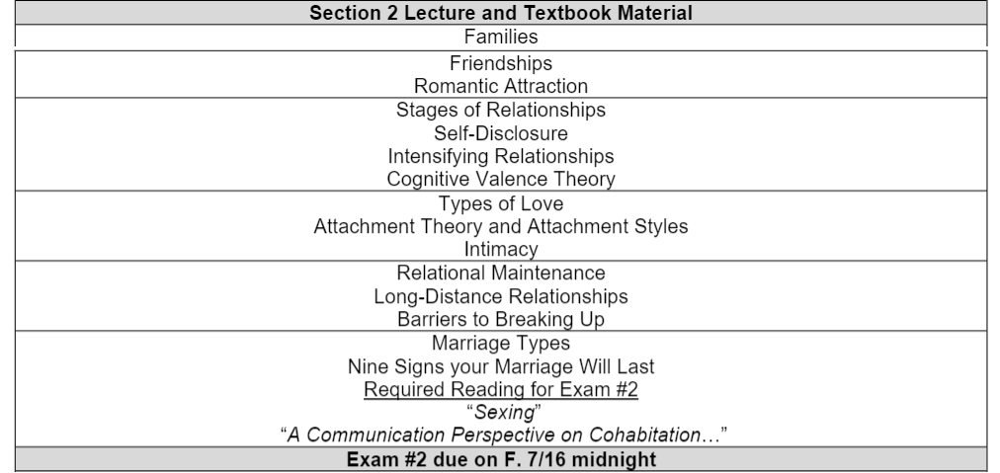

#CMN 120 Summer session Note

[TOC]
---
## Important Notes of Syllabus&Times
* **Evaluation Methods:** Your grade for the course will be determined by ==three exams== and up to ==three points of extra credit== (optional).
* **Multiple-choice and true-false questions** on Quizzes is 30-45 seconds per question. ==35 minutes to 40 questions==.
* **Exams scheduled time:**

|Exams|Date|
| --- | --- |
|Exam #1|7/1 through to 7/2|
|Exam #2|7/15 through to 7/16|
|Exam #3|7/29 through to 7/30|

* **Extra Credits**:
  * 3 points in total
  * **You may participate in weekly class discussions to earn one point of extra credit.** After participating in a discussion, go to Assignments—Extra credit and write in the topic of the discussion. See separate document titled “Discussion for extra credit.”
  * Choose from the following Ted Talks to watch. **Please write a brief response describing three ways that you plan to apply the speaker’s ideas to your life.** You may respond in a bullet-point format. 
  * **Behavioral Commitments.** If you choose this option, please write out a total of six commitments—two for “continue,” two for “stop,” and two for “start.” 

---
## Exam 1

### Variables in Communication:

* **The goal**: Shared meaning between source and receiver
* **Source**: The originator of a thought or idea. Also, known as the "Sender."
* **Encode**: To put an idea into language or gesture
* **Message**: Verbal and nonverbal elements of which people assign meaning.
* **Meta-message**: Indirect or nonverbal elements of which people assign meaning.
* **Channel**: A pathway through which messages are conveyed.
* **Receiver**: The party who interprets a message.
* **Decode:** To interpret or assign meaning to a message
* **Noise**: Anything that interferes with the encoding or decoding of a message. There are two types of noise: Physical and psychological. 
* **Feedback**: Verbal and nonverbal responses to a message. 
* **Context**: The physical, psychological, cultural, and relational environment in which communication occurs. 
* **Meaning**: What the receiver ends up with.

<iframe width="426" height="344" src="https://www.youtube.com/embed/1cYgyqA_7BM" title="YouTube video player" frameborder="0" allow="accelerometer; autoplay; clipboard-write; encrypted-media; gyroscope; picture-in-picture" allowfullscreen></iframe>

> **Senders** and **receivers** have **goal**.
> 
> Source **encode** **messages** then send to receiver over the **channel**.
> 
> After decoding messages, receivers provided **feedback** based on their degree of understandings or agreements.  
> 
> **Context** shapes the **meaning** that people end up with.
>  
> Receivers **decode** **the message** provided by senders.
> 
> **Message** is what we say by specifically using words. In the video, wearing the leather jacket is the **meta-message** **(impresssion we gained)** that the judge thought the main character was disrespect him.
> 
> In the video, the judge had the **psychological noise**, because in his culture he doesn't approve his dressing.

* **Physical noise**: anything related to the environment so that our message can't be conveyed properly, usually not under our control, horns, air vent, not really under your control, any physical environmental things.
* **Psychological noise**: represents a distraction in our mind that prevents us from receiving the message ie: thinking about other things so you can't focus, daydreaming, stress, hunger, etc.

---
### The Cooperation Principle

**Definition**:
* The mutual goal of communication for both senders and receivers is to end up with some degree of =="shared meaning."== 
* **The “cooperation principle” states that: “Receivers assume relevance, and senders are to guarantee relevance.”** 
* ==**relevance = interests**==
* The achievement of shared meaning requires concerted **cooperation and mutual effort from both the co-sender and the co-receiver.**
* Convey specific ideas to **specific audiences**.
* **Receivers assume relevance**: receivers will guess that what is the speaking gonna talk about that is relative to them. They are searching for information or statement that is relevance.
    >"What are you reading for?" A asked to her roommate B.
    "I'm reading a book."

The response from B is a **irrelevant statement** which is not A looking for. A may look for the name of the book. At this point, A will question the relevance of B's statement. Then, A will ask again to search for meaning.

---
### Communication Competence (胜任力)
**Interpersonal communication (IPC):**
> Exchange of messages, verbal and nonverbal, between people, **regardless of the relationship** they share.

**Relational Communication**:
> Is **narrower than IPC**; in that it focuses on messages exchanged in intimate, or potentially intimate, relationships.

**Communication competence:**
* **Definitions**: is the ability to communicate in a personally effective and socially appropriate manner.
* **Competent (胜任的；有能力的) communicators:** ==Effective and Appropriate==
    > Effective = achieves goals.
    Appropriate = doesn't offend; is socially appropriate 

**Process vs. Performative Competence:**

Scholars who study competence distinguish between two kinds of competence: **internal or process competence,** and **external or performative competence**.

* **Process competence:** 
    >**a deeper level**, ==consisting of everything== we have to know in order to perform.

* **Performative competence:**
  >**a surface level**, ==consisting of the part of the competence that can actually be seen-the actual performance of verbal and nonverbal behaviors.==

Process competence **precedes(先于)** performative competence.

**In order to be a competent communicator one must be able to:**
>1. **Assign meaning** to the world around them. (What is going on in this situation?) (Process)
>2. **Set goals** strategically. (What do I want to achieve/make happen? How should I contribute?) (Process)
>3. **Take on social roles** appropriately. (What is my relationship to others in this situation? How do I maintain or enhance my social responsibility?) (Process)
>4. **Present a valued image** of themselves. (How do I want others to view me in this situation?) (Process)
>5. **Generate intelligible messages**. Generate intelligible messages. Language and nonverbal “skills.” (Performative)

**Process competence requires:** 
> ==Perceptual awareness and accuracy, listening motivation and skills, and effective image management.==

---
### Perception and communication competence
**Perception (洞察力;知觉)：**
> The process of making meaning from the things we experience in the environment. 

**Perceptual filters:** 
>Every single individual **has a unique set of perceptual filters**, and therefore, **shared meaning is often difficult to achieve.** We all “filter” incoming communication through our perceptions, experiences, biases, and beliefs.

Like the judge and the main character in the video clip. They have different view toward "respect" based on their perceptions, experiences, biases, and beliefs.

==What one person hears isn’t always what the other person hears.==
==Our perceptions are often inaccurate.==

**Our ability to perceive accurately is affected by:**
>1. **Physiological states** (tired, hungry)
>2. **Psychological states** (anxious, hurt, angry)
>3. **Culture** (sex, age, ethnicity)
>4. **Social roles** (police officer, mother, teacher)

**Sources of Perceptual Inaccuracy:**
>1. **Stereotyping:** ==Relying on generalities, ignoring individual differences== 
>2. **The primacy effect:** The tendency to ==emphasize the first impression== over later impressions when forming a perception. 
>3. **The recency effect:** The tendency to ==emphasize the most recent impression== over earlier impressions when forming a perception. 
>4. **Perceptual sets:** ==A predisposition to perceive only what we want or expect to perceive.==
>5. **Egocentrism:** ==Unable to take another’s perspective.==
>6. **Positivity/negativity bias:** ==The tendency to focus heavily on a person’s positive/negative attributes== when forming a perception.

**Ways to improve perceptual accuracy:**
>1. **Being mindful**: Be aware of that fact that ==no two people will ever see everything in the exactly same way.== 
>2. **Know yourself**: We can ask ourselves how factors such as our experiences, sex, cultural background, and physiological states and traits might be affecting the perceptions we make. 
>3. **Imagine alternate perceptions**: This will also develop our emotional intelligence.

---
### Listening and communication competence

Listening is the **active process** of ==making meaning out== of another person's spoken message. It is a learned skill.

Effective listening requires **concerted and prolonged effort (motivation)**.

Listening is considered to be the most important and valued skill in the workplace.

**Types of Listening:**
>* **Informational**: learning
>* **Critical**: evaluating the credibility of messages
>* **Empathic**: emotionally supporting and understanding another

**Barriers to Effective Listening:**
>* **Pseudo-listening**: uses feedback behaviors that make it seem as if you’re paying attention even when you aren’t.
>* **Selective listening**: means listening only to what you want to hear.
>* **Information overload**: refers to the state of being overwhelmed by the large amount of information each of us takes in daily.
>* **Glazing over**: is daydreaming during the time you aren’t spending on listening.
>* **The rebuttal tendency**: is the tendency to debate a speaker’s point and formulate your reply while the person is still speaking.
>* **Being closed-minded**: means failing to listen to anything with which you disagree.
>* **Competitive interrupting**: interrupting to take control of a conversation.

---
### Image Management
Image (also known as “face”) is the way one wishes to be seen or perceived by others. 

Sometimes we behave “as ourselves” and sometimes **we choose to act in ways that projects a specific image that we want others to think that we are.** This is the process of image management. 

**Principles of Image management 形象管理:**
>* **Collaborative**: managing your identity, and others tend to behave in ways that encourage that image if they accept the image you portray.
>* **We manage multiple identities**: we hve ==multiples roles== in life with ==distinctive role expectations==, therefore we often enact a somewhat different identity for each one. Sometimes, we keep aspects of ourselves "in the closet" to avoid negative social perception.
>* **Complex**: Sometimes we have ==competing goals.== For example, we may want to come off as confident and credible in a speech but also humble and open-minded. 

**Image Management and Emotional Displays:**
An emotion is your body's reaction to any event that enhances or inhibits your goals.

**Emotional displays:** we show different emotions outwardly than what we actually feel inside.

We can use “displays” to intensify, de-intensify, simulate, inhibit, and mask our true feelings to others. **We often consciously decide what emotions to display based on shared cultural and situational expectations and norms.** 

---
### Emotions
Three classes of emotions are particularly relevant to interpersonal and relational communication:
>* **Joyful/affectionate:** happiness, love, passion, and liking.
>* **Hostile:** anger, contempt, disgust, jealousy, and envy.
>* **Sad/anxious:** sadness, depression, grief, fear, and social anxiety.

---
### Emotional Intelligence

**Emotional intelligence (EI and EQ) is a complex ability that involves:**
>* **Self-awareness**: Being aware of how one is feeling in the moment and towards others involved.

>* **Self-regulation**: The ability to control one’s impulse to act-out emotions in the moment regardless of the context or potential impact on the receivers.

>* **Motivation**: An internal drive to engage in mutually beneficial interactions. Similar to The cooperation principle.

>* **Empathy**: The ability to see or understand another’s point of view without having had the same experiences/perceptions or having to agree with the other person.  

>* **Social skill**: The ability to communicate verbally and nonverbally in a socially appropriate way that does not make receivers confused, defensive, or offended. 

---
### Verbal Communication Competence
**Performative Competence requires:**
* Verbal communication skills
* Nonverbal communication skills

**Verbal Communication Skills:**
*Grice's Conversational Maxims (rules) **(for senders)***
>* **Quantity:** provide just the right amount of information; not too little, not too much. ==Make long story short.==

>* **Quality:** ==be truthful, accurate, provide evidence, qualify when unsure.== Valid data, accurate information that is relevant to receivers.

>* **Relevance:** contribute to and ==stay on topic== until it has run its course.

>* **Manner:** be clear and ==socially appropriate.==

**Credibility and verbal skills:**
*One's degree of verbal skills affects his/her credibility*

* **Definition of credibility**: 
> is defined as =="the extent to which others find someone’s words and actions trustworthy."==

* **What NOT to do verbally:**
1. **Cliches:**
    >* These are phrases that were novel at one time but have lost their effect because of ==**overuse**.== Stop saying something over and over again.

    >* They can make you sound uninformed, out of touch, or unimaginative. 
2. **Dialects:**
    >* Dialects are ==**vocal variations on a language**== that are shared by people of a certain region or social class.

    >* According to communication accommodation theory, we may be able to enhance our credibility by speaking in a dialect this is familiar to our audience and by not doing so, may hurt our credibility.

3. **Allness statement**: 
    >These are declarations that imply that a claim is true ==without exception== (Using "always").

4. **Fallacious reasoning**: 
    >This is when someone attempts to provide reasons or evidence which are illogical, and therefore, ==untruthful.== It doesn't have quality.

5. **Harmful words**: 
    >==Language that harms a person’s reputation or image.== 
    **Libel (诽谤)**: A defamatory statement made in print or in some other fixed medium. 
    **Slander (诋毁)**: A defamatory statement made aloud.

    > Libel and slander are types of defamatory statements. Libel is a defamatory statement that is ==written==. Slander is a defamatory statement that is ==oral==. At common law, libel and slander were analyzed under different sets of standards, with libel recognized as the more serious wrong.

6. **Profanity (socially offensive use of language,)**: 
    > ==Offensive language==. A form of language considered vulgar, rude, or obscene in the context in which it is used.

7. **Impervious response**: 
    > ==Ignoring the person altogether==. Opposite of recognition. 

8. **Verbal abuse**: 
    > Insults, put downs, trash talking, criticizing, name-calling, etc.
9. **Irrelevant response**: 
    > Replying with a completely ==unrelated statement==. A reply that is **not only off-topic, but also conveys the message that you don’t care enough to pay attention to the other’s words.** 
10. **Dismissive (表現輕視的;拒绝的) response**:  
    > Implies that you are ==indifferent to that message==. 
11. **No follow up to an important message**: 
    > When someone has discussed something of importance and the ==listener never initiates a follow up==. 

**What to do verbally:**
* **Own your thoughts and feelings:** 
> The statements “I disagree,” and “You are wrong,” will have different impacts. The former indicates that one has an opposing opinion; the latter implies that the speaker’s facts are inaccurate. These are qualitatively different messages. ==Using "I" instead of "you."==

* **Recognition**: 
> ==Confirming that another person exists== and is worthy of your attention. Eye contact or easy a "hi".

* **Acknowledgement（认同）:**
> A more positive form of confirmation is to ==acknowledge another person’s feelings and thoughts.== You can do this by asking someone’s opinion, ideas, or ask about feelings. A good thing to say is: “Tell me more.” 

* **Endorsement（支持）:**
>This is signaling that you ==agree with what the other person== has said. 

---
### Nonverbal Communication Competence
* **Nonverbal Communication:**
    * **Nonverbal codes:** ==clusters of behavior== that are used to ==convey meaning==
    * It consists of all those message that people exchange beyond the words themselves.

**Nonverbal** is better for ==expressing emotions.==
**Verbal** is better for ==facts and information.==

* **Nonverbal Communication Codes:**
    > 1. Facial expressions
    > 2. Eye behavior
    > 3. Posture
    > 4. Gestures
    > 5. Vocalics/Paralanguage (副语言)：可以通过使用韵律，音高，音量，语调等技术来修改含义，赋予细微差别的含义或传达情感。
    > 6. Proxemics (个人空间 )
    > 7. Haptics (振动)/Touch 
    > 8. Chronemics (时间学): the role of time in communication.
    > 9. Environment

* **Be aware of your meta-message:**
    > ==The message is what we say and the meta-message is how we say it.== Nonverbal scholars have learned that **when our nonverbal behaviors appear to contradict our verbal message, receivers will trust the nonverbal.**

    > Imagine if someone yelled: “I am not angry!” What is the receiver going to believe, the words or the volume and tone of voice?  Because **nonverbal cues are so effective at conveying emotions**, we may end up letting our negative emotions toward a situation or a person “leak” through our nonverbal behaviors when we don’t want to. 
    
    > **Facial expressions and the voice are both very powerful in conveying one’s meta-message** and so we should avoid doing such things like rolling our eyes or using a sarcastic or condescending tone because the meta-message is what your receiver is going to end up going with.

* **Engage in direct eye contact but avoid staring:**
    > In North American cultures direct eye contact is essential in order to be perceived as competent, credible, and trustworthy.

* **Develop a strong posture:**
    > We perceive people with upright postures to be strong, self-confident, and credible. **The better the posture a person has, the more we attribute leadership qualities to them.**

    > Convicted rapists report that they proactively choose to attack people with slouched postures because they perceive them to be less likely to put up a fight. 

* **Be sensitive to people's personal space needs:**
    > We move closer to people we know better or when the topic is personal. 

    > We move farther away from people we know less well or when the topic is of a professional, impersonal nature.

    > **Cultures** (and certain individuals within cultures) **vary** in how close they like to stand next to one another when conversing. North Americans tend to prefer more distance when conversing. 

* **Understand the benefits and the pitfalls of touch:**
    >Touch is essential for infants and young children to grow and thrive into healthy, well-adjusted human beings. Babies who were denied touch can develop severe health problems.

    > **Touch enhances health and longevity in older people.** Sadly, however, as we grow older, we receive less and less touch. 

    > **Some people perceive touch as a expression of love.** On the other hand, some people are touch-adverse, and so it is a complicated form of nonverbal communication. We need to be careful in our use of touch. Especially, the kinds of behaviors that can be perceived as sexual. 

* **Respect of people's time:**
    >**Chronemics is the study of the use of time as communication**.

    > ==People show their sense of superiority or positional power by using other people’s time== and by not following the same time rules as others “lower” than them in a hierarchy. 

    > People also show that they like someone by how much time they ask to spend with another person. If we like someone, we typically want to see or talk with them more frequently, have longer visits or interactions, and will desire to spend special times (like New Year’s Eve)  with them. 

* **Beware of cultural differences in nonverbal communication:**
    > **some nonverbal behaviors are interpreted similarly around the world and others are culturally-based.** 

    >It is advisable to research what the nonverbal practices and taboos are in other countries before you visit. This is especially true for emblems. Emblems are hand gestures that translate to a precise verbal meaning. Like sign language. However, ==the same gesture may have very different meanings in different cultures.== Famous mistake: President Nixon’s use of his “victory” emblem presented to a country who use that gesture for the F-word. 

* **Nonverbal Communication as a Receiver:**
    > Being an effective receiver of messages requires two separate but interrelated skills:
    >* **Being sensitive to nonverbal messages** 
    >* **Interpreting their meaning accurately.** *(There is no dictionary for nonverbal behaviors.)*

---
### Immediacy-A special kind of performative competence
* **Immediacy:** an effective communication style. It is the open expression of liking and acceptance of another person by engaging in messages that show friendliness, openness, and caring. 

* **Verbal immediacy** is what people say that causes us to feel closer to one another. 

* **Nonverbal immediacy** is what people do that cause us to feel closer to one another. 

* **Outcomes of Verbal and Nonverbal Immediacy:**
  * increased mutual liking, affiliation, and affect
  * more approachable
  * increased solidarity
  * decreased anxiety
  * decreased status differences
  * increased perceptions of communication competence
  * immediacy behaviors lead to increased relational connection between the parties involved. 

* **Nonverbal immediacy behaviors:**
  * Dressing appropriately to the situation (Her friend-wearing baseball cap; His wife dressed up for him, showing up respect to others based on situation.)
  * Leaning toward; open body orientation
  * Nodding
  * Eye contact
  * Smiling; pleasant facial expression
  * interested voice
  * sitting closer
  * being sensitive to and honoring time constraints

* Verbal immediacy behaviors:

* Potential drawbacks to immediacy:

---
### The Interactional Effect

---
### Relationship Types

---
### Risks and Rewards

---
### Theories of Forming Bonds

---
### Required Readings

---
### Lecture examples&Youtube

* **Youtube videos:**
1. ***My Cousin Vinny***
    >* Illustration of metamessage: Vinny, from New York, is in Alabama trying his first legal case ever, and is wearing a leather jacket and leather pants. The judge perceives those clothes to be disrespectful. Vinny just dresses that way, but the judge is very disapproving because the =="metamessage" of leather clothing "means" "informality"== and he wants his courtroom to be "formal. So, Vinny has to buy himself a brand new suit. But one day (because everything keeps going wrong), his brand new suit got mud all over it right when court was about to start.

    >* When Vinny wore the leather jacket in the courtroom, the judge felt disrespect toward it. 

    >* 总结：

2. ***Goodwill Hunting*** 
    >* 

3. ***Devil Wears Prada***
    >*

* **Verbal Communication Competence:**
    >1. **Examples in quality (qualify, point out the degree of validity of evidence)**: Professor attended San Diego State University program and thought it was still hight rated. When she tried to recommend this program, she realized it was long time ago and was unsure about recent quality of this program. **失去时效性的evidence**。

    >2. **Change the topic (relevance)**: Her own experience in a conversation. We at least should ask the change of topic.

    >3. **Understandable message (clarity, socially appropriate)**: Her son doesn't use regular language, but it is annoying because professor did not know the meaning of it. 

    >4. **Dialects (actual sound system)**: Documentary of a young woman who graduated from MIT. After graduation, she did not get a job by her 15 interviews because of her New Jersey accent.

    >5. **Impervious response (无动于衷的回应)**: Her own experience about her boss that ignore her when saying "hi". 

    >6. **No follow up**: A example of a good friend of her husband. Her house was burned down years ago. She told her situation to her friend, but after a week she talked to her regularly. **漠不关心，没有进一步话题**。

* **Nonverbal Competence:**
    > 1. **Voice, face, and body to convey one's feelings:** She wanted to have closer relation with her sister. When she saw professor, she lighted up and yelled to professor. 
    > 2. **Meta-message**: First ticket in her life. Her meta-message sometimes conveyed some emotions, like anger. Taking ticket of -> taking sunglasses off. Prevent true negative emotion leaked out.

---
## Exam 2

---
## Exam 3

---
