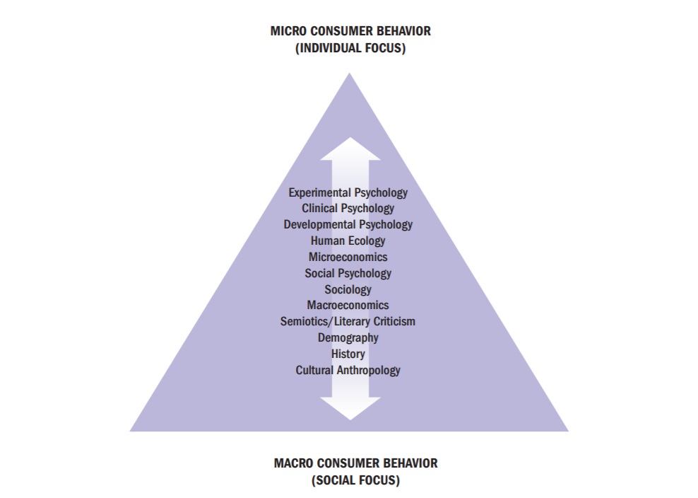
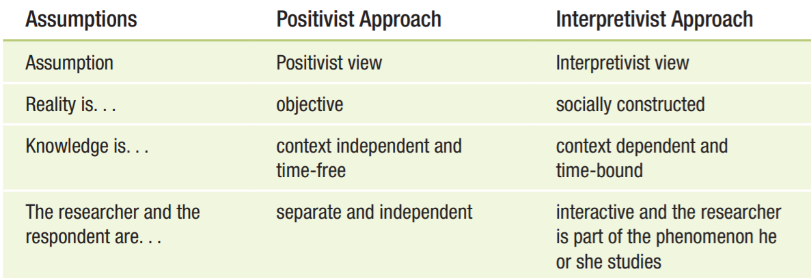

#CNS 100 Summer session Note

[TOC]

## Important Notes of Syllabus&Times
* Overview of buyer behavior and an appreciation of the valuable contribution that buyer behavior can make to business, public organization, nonprofit organizations, and consumers.

| Requirements           | Grading |
| ---------------------- | ------- |
| Midterm                | 50      |
| Final                  | 100     |
| Project                | 70      |
| 3 Original discussions | 15      |
| Participation          | 5       |
| Total Grades           | 240     |

* **TWR 4:10-5:50 pm.**
* **中国时间：7:10-8:50 am.**
* **Exams**: ==Short answer questions.== 3 original discussion posts (5 points each) to help students review the material write two double spaced paragraphs on the given question and post your response on Canvas due Thursdays.
* **Projects**: All projects are to be presented orally at dates assigned. A 2-page written report is due the day of the oral presentation. 

----
## Course Outline
|Week|Date|Chapter&Content|
| --- | --- | --- |
|1|6.22, 23, 24|Chapter 1~3, Video AFLAC|
|2|6.29, 30, 7.1|Chapter 4, Group pres, Discussion1|
|3|7.6, 7, 8|Chapter 5~6, **Midterm**|
|4|7.13, 14, 15|Chapter 7~8, Discussion2|
|5|7.20, 21, 22|Chapter 9, Discussion3|
|6|7.27, 28, 29|Chapter12, **FINAL**|

---
## Group Projects
**Group numbers: 4**

**Wednesday   6/ 30/ 21**   

* Projects are to be presented orally at dates assigned. A 2-page written report is due the day of the oral presentation.

**Topic: Learning and Memory (groups 3 &4)**
* Applications of Classical Conditioning in Marketing/Advertising
* Select radio advertisement, television commercials, print ads, etc. that illustrate the application of classical conditioning in marketing. Analyze the advertisements and explain how the advertisements incorporate the elements of the classical conditioning model. In addition, you may want to create ads that incorporate the classical conditioning model and/or you may want to illustrate how you would “improve” existing ads to fit the classical conditioning paradigm. 

---
## WEEK 1
### Chapter 1
**1-1 Consumer’‘ Behavior: People in the Marketplace**
*Consumer behavior is a process.*

* Markets categorize consumer in terms of his age, gender, income, or occupation. Knowledge of consumer characteristics plays an extremely important role in many marketing applications
> Ages, gender, income, or occupation are descriptive characteristics of a population, or **demographics**.
* Consumers' decision will influence by television commercials, magazines, or billboards. 
> The growth of the internet has created thousands of online **consumption communities**, where members share opinions and recommendations.
* As members of a large society, such as in the United States, people share certain cultural values, or strongly held beliefs about the way the world should function. For some consumers, some brands are attractive to them or not.
> The use of **market segmentation strategies** means an organization ==target== its product, service, or idea only ==to specific groups== of consumers rather than to everybody. 
* Brands often have clearly defined images, or **“personalities,”** that advertising, packaging, branding, and other marketing elements help to shape.People often purchase a product because they like its image or because they feel its “personality” ==somehow corresponds to their own.==
* When a product or service **satisfies our specific needs or desires**, we may reward it with many years of **brand loyalty**, which is ==a bond between product and consumer==.

**What is Consumer Behavior?**
* **Definition**:
    >The field of consumer behavior covers a lot of ground: ==It is the study of the processes involved when individuals or groups select, purchase, use, or dispose of products, services, ideas, or experiences to satisfy needs and desires.==

**Consumer Behavior Is a Process.**
* **The exchange:**
> a transaction in which two or more organizations or people give and receive something of value, is an integral part of marketing.

>**Stages of the consumption process:** Pre-purchase issues, purchase issues, and post-purchase issues.

* **A consumer:**
>a person who identifies a need or desire, makes a purchase, and then disposes of the product during the three stages of the consumption process.

>In other cases, another person may act as an **influencer** ==when he or
she recommends certain products without actually buying or using them==.

---
**1-2 Consumers Are Different! How we Divide Them up?**
*Marketers have to understand the wants and needs of different consumer segments.*

* heavy users = faithful customers
* 80/20 Rule: 20 percent of users account for 80 percent of sales.

>1. **Age**
>2. **Gender**
>3. **Family Structure**: a huge effect on consumers’ spending priorities
>4. **Social Class and Income**:  in terms of income and social standing in the community
>5. **Race and Ethnicity**
>6. **Geography**
>7. **Lifestyles**
>8. **Segmenting by Behavior: Relationships and "Big Data":**
>  * **Relationship marketing**:  interact with customers on a regular basis and give them solid reasons to maintain a bond with the company over time.
>  * **Database marketing**: tracks specific consumers’ buying habits closely and tailors products and messages precisely to people’s wants and needs based on this information. 
> 9. **User-Generated Content (UGC):** everyone can voice their opinions about products, brands, and companies on blogs, podcasts, and social networking sites such as Facebook and Twitter, and even film their own commercials that thousands view on sites such as YouTube. T

---
**1-3 Marketing's Impact on Consumers:**
*Our choices as consumers relate in powerful ways to the rest of our lives.*

**Popular culture:**
>the music, movies, sports, books, celebrities, and other forms of entertainment that the mass market produces and consumes—is both a product of and an inspiration for marketers.

We increasingly live in a branded world, where advertisers promote events and places of all kinds.

**Role Theory:**
> Consumers act many roles that they sometimes alter their consumption decisions depending on the particular "play" they are in at the time. 

**Types of relationships a person might have with a product**:
>* **Self-concept attachment:** the product helps to establish the user's identity.
>* **Nostalgic attachment:** the product serves as a link with a past self.
>* **Interdependence:** the product is a part of the user's daily routine.
>* **Love:** the product elicits emotional bonds of warmth, passion, or other strong emotion.
---
**1-4 What Does It Mean to Consume?**
*Our motivations to consume are complex and varied.*

People often buy products not for what they do, but for what they mean.

**Need:** ==is something a person must have to live or achieve a goal.==
**Want:** ==is a specific manifestation of a need that personal and cultural factors determine.==

---
**1-5 The Global "Always-On Consumer":**
*Technology and culture create a new "always-on" consumer*

**Internet of Things (IoT):** 
>refers to the growing network of interconnected devices embedded in objects that speak to one another.
---
**1-6 Consumer Behavior as a Field of Study**
*Many types of specialists study consumer behavior*

**Two Perspectives on Consumer Research:**
* **Positivism:** 
    >It emphasizes that ==human reason is supreme== and that ==there is a single, objective truth that science can discover==.

    >**实证主义是一种以“实际验证”为中心的哲学思想。广义而言，任何种类的哲学体系，只要求知于经验材料的思辨，都为实证主义。**
    
    >Positivism encourages us to **stress the function of objects**, **to celebrate technology**, and to **regard the world as a rational**, **ordered place with a clearly defined past, present, and future**.

* **Interpretivism (or *postmodernism* or CCT):**

    >Instead stress the importance of symbolic, subjective experience,
and the idea that meaning is in the mind of the person—that is, **we each construct our own meanings based on our unique and shared cultural experiences, so there are no right or wrong answers.**

    >In their view the world is a **pastiche**, or **mixture of images and ideas.**

    >**解释主义：主张人类对世界的体验并非是对外界物质世界的被动感知与接受，而是主动的认识与解释。**

    >==**实证主义和解释主义最根本的区别是实证主义着眼于世界普遍规律，目的在于解释世界；而解释主义关注点在于世界的差异性，未来更好理解世界。**==

---
**1-7 Consumer Trends: Keep Ahead to Keep Up**
*There are differing perspectives regarding how and what we should understand about consumer behavior*

**Consumer trends:**
>Underlying values that drive consumers toward certain products and services and away from other.

>==It’s crucial to track not just where consumers are, but where they’re going.==

Some important consumer trends:
>1. Sharing economy
>2. Authenticity and personalization
>3. Blurring of gender roles
>4. Diversity and multiculturalism
>5. Social shopping
>6. Income inequality
>7. Healthy and ethical living
>8. Simplification
>9. Interconnection and the Internet of Things
>10. Anonymity

---
### Chapter 2
**2-1 Business Ethics and Consumer Rights**
*Ethical business is good business*

**Business ethics:**
> * These are rules of conduct that **guide actions in the marketplace**; these are the **standards** against which most people in a culture judge what is right and what is wrong, good or bad.
> 
> * These **universal values** include honesty, trustworthiness, fairness respect, justice, integrity, concern for others, accountability, and loyalty

**Consumerspace:**
>In the new environment,many people now ==feel empowered to choose how, when, or if they will interact with corporations as they construct their own consumerspace.== Individuals dictate to companies the types of products they want and how, when, and where they want to learn about those products.

>**People still "need" companies-but in new ways and on their own terms.**

* A need is a basic biological motive; a want represents one way that society has been taught to satisfy the need.
    >A basic objective of marketing is to create awareness that needs exist, not to create needs.
* Products meet existing needs, and marketing activities only help to communicate their availability. 
  * **The economics of information** perspective regards advertising as an important source of consumer learning.
* Marketers simply do not know enough about people to manipulate them.
---
**2-2 Consumers' Rights and Product Satisfaction**
*Marketers have obligation to provide safe and functional products as part of their business activities*

**Three possible courses of action if you're not happy with a product or service**:
>1. **Voice response**: You can appeal directly to the retailer for ==**redress（纠正；补偿）**== (e.g., a refund).

>2. **Private response**: You can express your ==dissatisfaction== to friends and ==boycott== the product or the store where you bought it.

>3. **Third-party response**: You can take ==legal action== against the merchant, register a complaint with the Better Business Bureau, or write a letter to the newspaper.

**Marketplace sentiments:**
> consumers' feelings about companies or market practices.

**culture jamming:**
> A strategy to disrupt efforts by the corporate world to dominate our cultural landscape.

> 文化干扰的目标是通过干扰正常的消费行为来揭示广告、媒介信息和人造消费商品背后的意识形态。

**Corporate Social Responsibility (CSR) 企业社会责任:**
* Consumers are especially interested in choosing brands that support causes they find personally relevant. These causes include medical cures and disease prevention, social change, faith-based initiatives, and animal and child welfare.

> CSR describes processes that **encourage** ==the organization to make a positive impact on the various **stakeholders (利益相关者)** in its community== including consumers, employees, and the environment.

>For example, a shoe company gave a promise to give a needy child a pair of shoes for every pair it sells.

**Transformative Consumer Research (TCR) 转型消费者研 :**
>Scientists who subscribe to this perspective **ivew consumers as collaborators who work with them ro realize this change rather than as a "phenomenon" on which to conduct research.** 

> It promotes research projects that include the goal of ==helping people or bringing about social change.== 

> **从==消费者研究==出发，促进消费者的生活能有正面的改变。从种改变包括对现在和未来的下一代消费者，透过特别的研究行为，形成具人文意义和实用性的传播方式。**

**Social marketing 社会营销:**
> ==The promotion of causes and ideas (social products)==, such as energy conservation, charities, and population control

> 基于人具有“经济人”和“社会人”的双重特性，**运用类似商业上的营销手段达到社会公益的目的；或者运用社会公益价值推广其商品或商业服务一种手段**。与一般营销一样，社会营销的目的也是有意识地改变目标人群（消费者）行为。

> For example, marketers normally employ to sell beer or detergent to encourage positive behaviors such as increased literacy and to discourage negative activities such as drunk driving.

**Cause marketing 动机营销:**
> A strategy that aligns (give support to) a company or brand with a cause to **generate business and societal benefits**.

>**公司透过动机营销达成获利及贡献企业社会责任的目的**,是一种企业社会责任。
---
**2-3 Major Policy Issues Relevant to Consumer Behavior**
*Consumer behavior impacts directly on major public policy issues that confront our society*

**Real-time bidding:**
> An electronic trading system that sells ad space on the webpages people click on at the moment they visit them (our digital action). 

In industry parlance, each digital ad space is an impression. The value of an impression depends on several factors, like the size of the ad, the type of person who is available to see it and that person's location.

**Identity theft:**
> Identity theft occurs when someone ==steals your personal information and uses it without your permission.==

>* **High-tech phishing scans** **(网络钓鱼)**: people receive fraudulent emails that ask them to supply account information
>* **Botnets** **(僵尸网络)**: a set of computers that are penetrated by malicious software known as malware that allows an external agent to control their actions

* **Locational privacy:**
>The extent to which a person’s activities and movements in the physical world are tracked by his or her devices such as smartphones

* **Market Access: the ability to find and purchase goods and services**
> * **Disabilities:**
>   * **Types of disabilities:** 
>       * ==limited mobility 流动性==: are unable to gain easy access to gain products and services.
>       * ==Bodily limitations or disfigurements==
>       * ==Mental illnesses==
>   * **Technology that improve market access**: 
>       * The touch screen
>       * Dating websites for singles with the health problems allow people with an array of disabilities.
>       * Adaptive clothing provides a broader range of apparel options.

> **Limited access to healthy choices:**
>   * **Food desert**: a census tract where 33 percent of the population or 500 people, whichever is less, live more than a mile from a grocery store in an urban area or more than 10 miles away in a rural area.
>   * It can lead to poor diets and higher levels of obesity and other diet-related diseases.

> * **Literacy:**
>   * **Media literacy 媒体素养:** a consumer's ability to access, analyze, evaluate, and communicate information in a variety of forms, including print and non-print messages.
>       * Media literacy empowers people to be both critical thinkers and creative producers of an increasingly wide range of messages using image, language, and sound. 
>   * **Functionally illiterate 功能性文盲:** a person whose reading skills are not adequate to carry out everyday tasks, such as reading the newspaper ot the instructions on a pill bottle. 指具有阅读、书写或计算能力，但是却缺乏利用这些能力“来处理某些日常生活事务或应聘的能力”。
>   * **Disadvantages of this limitations that impedes market access:**
>       * The illiterate consumer is at a disadvantage because he or she encounters difficulty in learning about the best purchase options.
>       * May experience will be forced to reveal the inability to read a label or other written material.
>       * Low-literate consumers rely heavily on visual cues, but often make mistakes when they select similarly packaged products.
>       *Numeracy (understanding numbers)

**Sustainability and Environmental Stewardship (管理方法；组织方式):**
> * **Conscientious consumerism 道德消費**: the consumer's focus on personal health is merging with a growing interest in global health.

> * **A triple bottom-line orientation (三重底线)**: business strategies that ==strive to (put effort on) maximize return (reward, profit)== in three ways. 一个企业最重要的不是如何实现利益最大化，而是坚持三重底线原则。
>       * **The financial bottom line:** Provide profits to stakeholders (持股人;利益相关者).
>       * **The social bottom line:** Return benefits to the communities where the organization operates.
>       * **The environmental bottom line:** Minimize damage to the environment or even improve natural conditions.

> * **Green marketing:** describes a strategy that involves the development and promotion of environmentally friendly products and stressing this attribute when the manufacturer communicates with customers.
>   * **The difficulties of "buying green":** 
>       * More expansive
>       * Greenwashing: companies make false or exaggerated claims about how environmentally friendly their products are. 

> * **LOHAS**: **an acronym for "lifestyles of health and sustainability."** This label refers to people who worry about the environment, want products to be produced in a sustainable way, and spend money to advance what they see as their personal development and potential.  

---
**2-4 The Dark Side of Consumer Behavior**
*Consumer behavior can be harmful to individuals and to society*

* **Consumer Terrorism:**
> * **Types of terrorism:**
>   * bioterrorism 生物恐怖主义 
>   * cyberterrorism

* **Addictive Consumption:**
> * **Types of addictions**:
>   * **Consumer addiction:** physiological or psychological dependency on products or services.
>   * **Social media addiction:** dependency on interaction with social networking platforms to the extent that signs of withdrawal appear if the person is unable to connect.
>       * Cyberbullying: willful and repeated harm inflicted through the use of computer, cell phones, and other electronic devices.
>       * Phantom Vibration Syndrome 幻觉振动症状: the tendency to habitually reach for your cell phone because you feel it vibrating, even if it is off.

* **Compulsive Consumption 强迫消费:**
> **Definition:** repetitive and often excessive shopping performed as an antidote to tension, anxiety, depression, or boredom.
> Three common elements of negative and destructive consumer behaviors:
>   * The behavior is not done by choice.
>   * The gratification derived from the behavior is short-lived.
>   * The person experiences strong feelings of regret or guilt afterward.
>     (*examples: gambling*)

* **Consumed Consumers (商品化消费者；将人作为商品):**
> **Definition:** people who are used or exploited, willingly or not, for commercial gain in the marketplace

> **Examples:**
>   * Prostitutes (妓女)
>   * Organ, blood, and hair donors
>   * Babies for sale

* **Illegal Acquisition and Product Use:**
> * **Consumer Theft and Fraud:**
>   * Shrinkage: the industry term for inventory and cash losses from shoplifting and employee theft. 
>   * Serial wardrobers: who buy an outfit, wear it once, and return it.
>   * Counterfeiting: companies or individuals sell fake versions of real products to customers.

* **Anticonsumption:**
> **Definition:** events in which people deliberately deface or mutilate (破坏) products and services. 

---
### Chapter 3

---
### Video AFLAC

---
### Lecture note

#### 6/22 note
* Age affect marketing and consumption
* We start to make gender distinctions at very early age.
* Marketers try to understand their customers and develop lifelong relationships.
* Marketers who follow this approach are said to follow the philosophy of relationship marketing.
* They may also utilize database marketing in order to track consumer's buying habits.
* Database marketing tracks specific consumers' buying habits very closely and crafts products and messages tailored precisely to people's wants and needs based on this information.
* **Popular culture:**
  * music
  * movies
  * sports
  * books
  * celebrities
  * entertainment
  * marketers influence preferences for movies and music
* **Consumer-Brand Relationship:**
  * self-concept attachment
  * nostalgic attachment
  * interdependence: daily routine
  * love

---
## WEEK 2

---
## WEEK 3

---
## WEEK 4

---
## WEEK 5

---
## WEEK 6

---
